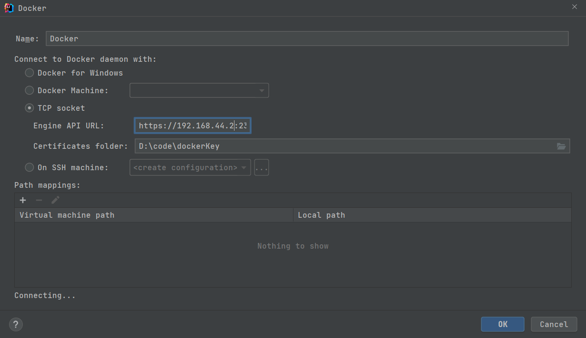

# docker远程连接tls配置

## 生成ssl证书

#### docker配置远程tls连接, 开启`2376`端口

> 在服务器上创建一个`tls.sh`的文件，执行`sh tls.sh`即可
```bash
#创建 Docker TLS 证书
#!/bin/bash

#相关配置信息
#docker主机IP
SERVER="192.168.44.23"
PASSWORD="pwdpwd"
COUNTRY="CN"
STATE="shanghai"
CITY="shanghai"
ORGANIZATION="shanghai"
ORGANIZATIONAL_UNIT="Dev"
EMAIL="23123213@qq.com"

###开始生成文件###
echo "开始生成文件"

#切换到生产密钥的目录
cd /etc/docker
#生成ca私钥(使用aes256加密)
openssl genrsa -aes256 -passout pass:$PASSWORD  -out ca-key.pem 2048
#生成ca证书，填写配置信息
openssl req -new -x509 -passin "pass:$PASSWORD" -days 3650 -key ca-key.pem -sha256 -out ca.pem -subj "/C=$COUNTRY/ST=$STATE/L=$CITY/O=$ORGANIZATION/OU=$ORGANIZATIONAL_UNIT/CN=$SERVER/emailAddress=$EMAIL"

#生成server证书私钥文件
openssl genrsa -out server-key.pem 2048
#生成server证书请求文件
openssl req -subj "/CN=$SERVER" -new -key server-key.pem -out server.csr

echo "subjectAltName=IP:${SERVER},IP:0.0.0.0" >> extfile.cnf
echo "extendedKeyUsage=serverAuth" >> extfile.cnf

#使用CA证书及CA密钥以及上面的server证书请求文件进行签发，生成server自签证书
openssl x509 -req -days 3650 -in server.csr -CA ca.pem -CAkey ca-key.pem -passin "pass:$PASSWORD" -CAcreateserial  -out server-cert.pem -extfile extfile.cnf

#生成client证书RSA私钥文件
openssl genrsa -out key.pem 2048
#生成client证书请求文件
openssl req -subj '/CN=client' -new -key key.pem -out client.csr

sh -c 'echo "extendedKeyUsage=clientAuth" > extfile.cnf'

#生成client自签证书（根据上面的client私钥文件、client证书请求文件生成）
openssl x509 -req -days 3650 -in client.csr -CA ca.pem -CAkey ca-key.pem  -passin "pass:$PASSWORD" -CAcreateserial -out cert.pem  -extfile extfile.cnf

#更改密钥权限
chmod 0400 ca-key.pem key.pem server-key.pem
#更改密钥权限
chmod 0444 ca.pem server-cert.pem cert.pem
#删除无用文件
rm client.csr server.csr

echo "生成文件完成"
###生成结束###

#开始修改docker启动配置文件
sed -i '19i --tlsverify \\' /usr/lib/systemd/system/docker.service
sed -i '20i --tlscacert=/etc/docker/ca.pem \\' /usr/lib/systemd/system/docker.service
sed -i '21i --tlscert=/etc/docker/server-cert.pem \\' /usr/lib/systemd/system/docker.service
sed -i '22i --tlskey=/etc/docker/server-key.pem \\' /usr/lib/systemd/system/docker.service
sed -i '23i -H tcp://0.0.0.0:2376 \\' /usr/lib/systemd/system/docker.service
sed -i '24i -H unix:///var/run/docker.sock \\' /usr/lib/systemd/system/docker.service

# 重新加载文件
systemctl daemon-reload
systemctl restart docker.service
```

#### 生成效果图


> 将`ca.pem`, `key.pem`, `cert.pem`拷贝到客户端

## 开启docker远程访问

1. 编辑`/usr/lib/systemd/system/docker.service`文件中的`ExecStart`

```bash
vim /usr/lib/systemd/system/docker.service

# docker.service文件
#ExecStart=/usr/bin/dockerd -H fd:// --containerd=/run/containerd/containerd.sock 初始配置
ExecStart=/usr/bin/dockerd -H fd:// --containerd=/run/containerd/containerd.sock \ 
-H tcp://0.0.0.0:2376 -H unix:///var/run/docker.sock \
--tlsverify --tlscacert=/etc/docker/ca.pem \
--tlscert=/etc/docker/server-cert.pem \
--tlskey=/etc/docker/server-key.pem
```

2. 或者修改`daemon.json`文件

```bash
vim /etc/docker/daemon.json

# daemon.json文件
{
    "tlsverify": true,
    "tlscacert": "/etc/docker/ca.pem",
    "tlscert": "/etc/docker/server-cert.pem",
    "tlskey": "/etc/docker/server-key.pem",
    "hosts": ["tcp://0.0.0.0:2376","unix:///var/run/docker.sock"],
    "registry-mirrors": ["https://registry.docker-cn.com","http://hub-mirror.c.163.com","https://docker.mirrors.ustc.edu.cn"]
}

```
> PS: 如果在修改`/etc/docker/daemon.json`后遇到启动失败的问题<br>
> 如: Job for docker.service failed because the control process exited with error code. See "systemctl status docker.service" and "journalctl -xe" for details.<br>
> 打开配置文件: `vim /usr/lib/systemd/system/docker.service`<br>
> 只保留`ExecStart=/usr/bin/dockerd`  把`-H fd://`这些都屏蔽掉<br>

3. 执行`systemctl daemon-reload && systemctl restart docker`重新加载docker配置

#### 测试
在服务器上使用以下命令来测试
```bash
docker --tlsverify --tlscacert=/etc/docker/ca.pem --tlscert=/etc/docker/cert.pem --tlskey=/etc/docker/key.pem -H tcp://192.168.44.23:2376 version
```


## Idea连接远程Docker

> `Engine API URL`: docker服务器ip加端口, `https://{ip}:{port}`<br>
> `Certificates folder`: 客户端证书目录, 服务器生成的`ca.pem`, `key.pem`, `cert.pem`文件拷贝到客户端的存放目录

