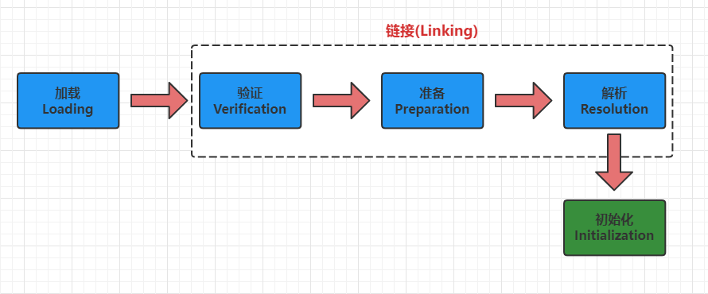

# 类加载

# 类加载机制概念
Java虚拟机把描述类的数据从Class文件加载到内存中，并对数据进行校验、转换解析和初始化，最终形成可以被虚拟机直接使用的Java类型，这个过程被称作虚拟机的类加载机制。

Class文件有类装载器装载后，在Jvm中将形成一份描述Class结构的元信息对象，通过该元信息对象可以获知Class的结构信息：如构造函数，属性和方法等。

# 类加载过程

* #### 第一步：Loading加载
> 通过类的全限定名(包名 + 类名)，获取到该类的。class文件的二进制字节流，将二进制字节流所代表的静态存储结构转化为方法区运行时的数据结构。
>
> 在`内存`中生成一个代表该类的`java。lang。Class`对象，作为方法区这个类的各种数据的访问入口。