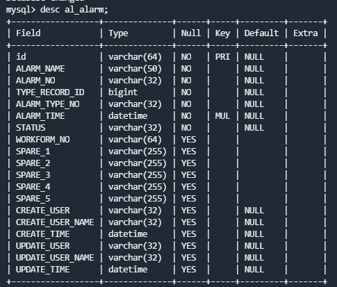
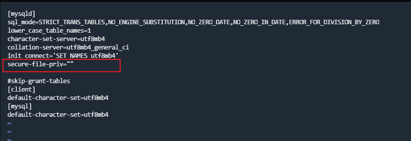
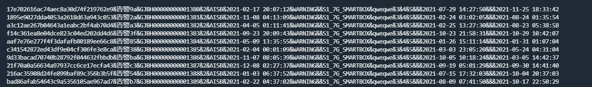
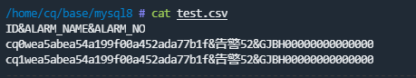

# 快速创建Mysql百万级数据

## load data infile方式
这种方式是Mysql提供的一种从文件快速导入的方式, 按特定的符号分隔, 插入到指定的字段(其实就是导入csv文件).
> ### Security Requirements</br>
> For a non-LOCAL load operation, the server reads a text file located on the server host, so these security requirements must be satisified:</br>
> * You must have the FILE privilege. [See Section 6.2.2, “Privileges Provided by MySQL”](https://dev.mysql.com/doc/refman/5.7/en/privileges-provided.html).
> * The operation is subject to the secure_file_priv system variable setting:
>   - If the variable value is a nonempty directory name, the file must be located in that directory.
>   - If the variable value is empty (which is insecure), the file need only be readable by the server.
>
> For a LOCAL load operation, the client program reads a text file located on the client host. Because the file contents are sent over the connection by the client to the server, using LOCAL is a bit slower than when the server accesses the file directly. On the other hand, you do not need the FILE privilege, and the file can be located in any directory the client program can access.


### 表结构


### Mysql配置文件
需要在`my.cnf`中的`[mysqld]`下加入`secure-file-priv=""`

如果不配置此项的话, 可能会出现如下错误, 这是因为 MySQL 自身的安全配置所致.
```shell
ERROR 1290 (HY000): The MySQL server is running with the --secure-file-priv option so it cannot execute this statement
```

### 数据文件
`alarm.txt`里面有100W的数据量, 生成的数据中使用的分隔符为`&`.



### 导入数据
使用命令`load data infile '/tmp/alarm.txt' replace into table user FIELDS TERMINATED BY '&';`


或者使用下面的命令可以指定列导入, csv文件的第一行为列名.
* `IGNORE 1 LINES`为忽略第一行
* `LINES TERMINATED BY '\n'`为行分隔符

```sql
LOAD DATA INFILE '/tmp/test.csv' INTO TABLE al_alarm
FIELDS TERMINATED BY '&'
ENCLOSED BY '"'
LINES TERMINATED BY '\n'
IGNORE 1 LINES
(id, alarm_name, alarm_no);
```
