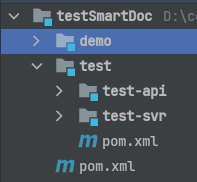

# Feign最佳实践

## 错误示范
#### Spring Cloud框架中的Feign的最佳实践, 网上很多案例都是: 
* `Feign`定义一次接口
* `服务提供方`的controller按照Feign的接口再实现一遍
* `消费方`使用Feign调用

这里目前的情况是`Feign`中定义的接口和`服务提供方`中实现的方法重复定义, 一不小心就容易写错或者新增和修改接口时漏了, 容易导致消费方调用异常.

## 最佳实践
* ##### 每一个服务有一个svr模块和api模块, api模块只做接口等定义, svr模块是具体的实现模块.
demo模块为服务消费方模块



* ##### 在api模块中定义需要提供的接口
api中的接口不要在类上使用@RequestMapping, 不然客户端那边此接口会被Spring Mvc加载, 如果有同样的path路径的话会导致程序无法启动.

```java
/**
 * @author Joker
 */
public interface TestApi {

    @PostMapping("/test/v1")
    String test();
}
```

* ##### svr模块里面实现定义的接口

```java
/**
 * @author Joker
 */
@RestController
@RequestMapping("/api")
public class TestController implements TestApi {

    @Override
    public String test() {
        return "test";
    }
}

```

* ##### 服务消费方定义FeignClient来继承接口
消费方定义FeignClient, 将Feign配置交给消费方.

```java
/**
 * @author Joker
 */
@FeignClient(name = "test-api", path = "/api", contextId = "TestApiClient", configuration = FeignConfiguration.class)
public interface TestApiClient extends TestApi {

}

```